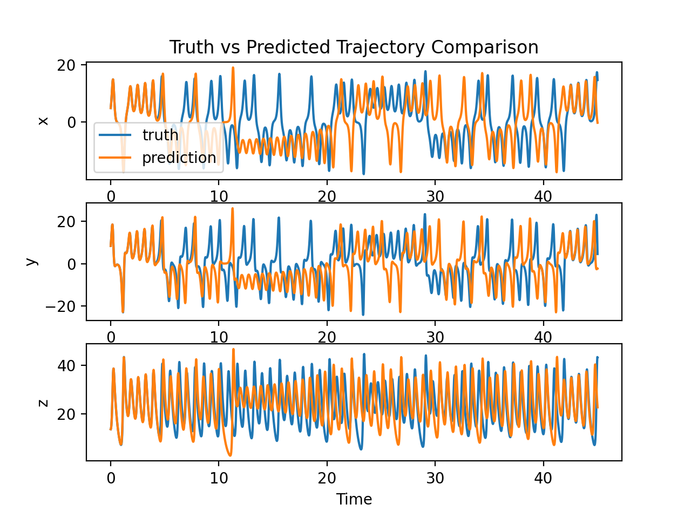
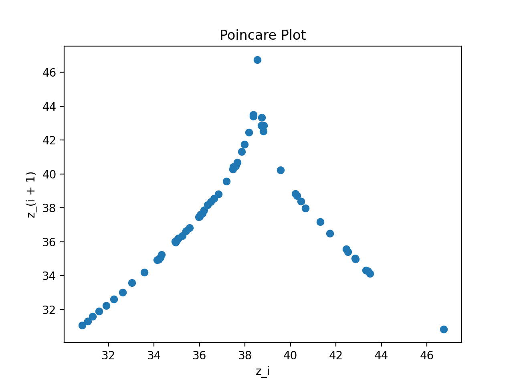

# About
My implementation of a [reservoir computer used to predict states of chaotic systems](https://arxiv.org/pdf/1710.07313.pdf). Includes code to generate data for Lorenz system, then predict future trajectories, as seen in the paper.

# Installation
Simply install packages found in requirements.txt and the code can be downloaded and run.

# Usage
Once dependencies are installed, run `python reservoir_computer.py` for a demonstration. This will generate a Lorenz trajectory then train a network to predict it. The prediction results and a poincare plot are displayed.

